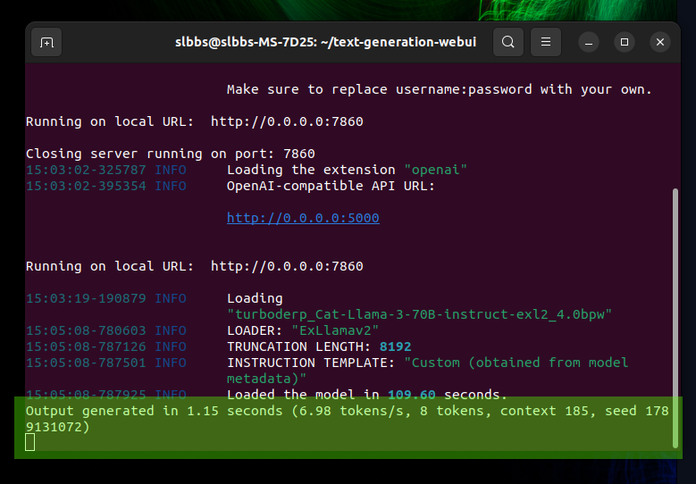

# R1 DIY Robot Kit

*Assembled R1 DIY Robot with face projection, ready for interaction.*

Welcome to the **R1 DIY Kit**! These files contain every step needed to manufacture and build your very own R1 robot. This DIY kit is based on the original R1 design, with the same internal design and hardware. 

While most instructions are provided in video format, important details can also be found in the accompanying README PDFs throughout the repository. Please read the provided documentation carefully to ensure successful assembly and setup.

## Table of Contents

1. [Gather Required Parts](#gather-required-parts)
2. [3D Printing Files](#3d-printing-files)
3. [Build Instructions](#build-instructions)
4. [Software Setup](#software-setup)
   - [Pre-Setup](#pre-setup)
   - [Robot Computer Setup](#robot-computer-setup)
   - [Installing Unity](#installing-unity)
   - [Starter Mode for Mac](#starter-mode-for-mac)
   - [Starter Mode for Windows](#starter-mode-for-windows)
   - [Face Adjustment](#face-adjustment)
   - [Pausing the Robot](#pausing-the-robot)
   - [Custom Faces](#custom-faces)
   - [Arduino Setup](#arduino-setup)
   - [Advanced Mode](#advanced-mode)
5. [Unity Project Files](#unity-project-files)
6. [Connecting to a Local LLM](#connecting-to-a-local-llm)

---

## 1. Gather Required Parts

Before you begin building, print the files and gather all the necessary parts. Here is the bill of materials with links to the components you will need to purchase:

- [Parts List README (PDF)](./pre-setup/R1_Parts_List_README.pdf)

---

## 2. 3D Printing Files

The robot's frame is 3D printed. All the necessary STL files and instructions for printing are included in the following folder. Please refer to the "Printing Guide PDF" for important details about printing the pieces:

- [STL Files for 3D Printing](./build-instructions/Printing_Files)
- [Printing Guide (PDF)](./build-instructions/R1_Printing_README.pdf)

---

## 3. Build Instructions

Once you have printed all the parts, it's time to assemble the robot. Follow the video link and refer to the provided assembly guide for detailed instructions:

- [Assembly Instructions PDF](./build-instructions/Instruction_README.pdf)
- [Build Instruction Video](https://youtu.be/2tXyRC_KmT0)

---

## 4. Software Setup

After building the robot, the next step is setting up the software. Most of the instructions are in video format, and the following index outlines the sequence to follow for setting everything up.

### Pre-Setup

Start by setting up the required API keys. You will need both an OpenAI API Key and an Azure Key.

- [Azure Key Setup Video](https://youtu.be/wxKWgDN9a2c)
- [OpenAI Key Setup Video](https://youtu.be/aMjvTZvdCsI)

---

### Robot Computer Setup

Next, set up the robot's computer to run the required software. Follow the instructions in the video below:

- [Computer Setup Video](https://youtu.be/bzLXkPkEXfA)

---

### Installing Unity

You will need to install a specific version of Unity to configure the robot. This guide covers installation for both Mac and Windows users:

- [Unity Installation Video (Cross-platform)](https://youtu.be/6DMLwrmqWGs)

---

### Starter Mode for Mac

Mac users should follow the instructions in the video below to set up Starter Mode for the robot:

- [Starter Mode Mac Video](https://youtu.be/YG3O_CxVHSQ)

---

### Starter Mode for Windows

Alternatively, Windows users can follow this video for setting up Starter Mode:

- [Starter Mode Windows Video](https://youtu.be/5EzZFH6TbZU)

---

### Face Adjustment

Once the software is set up, you may want to adjust the robot's projected face. This video provides a comprehensive overview of how to make these adjustments. Make sure to read the accompanying PDF for important projector notes:

- [Face Adjustment Video](https://youtu.be/Ks0d70vO0KM)
- [Projector README (PDF)](./face-adjustment/Projector_README.pdf)

---

### Pausing the Robot

To learn how to pause and resume the robot while it is running, refer to the following video:

- [Pausing the Robot Video](https://youtu.be/hnXKXJgQXd8)

---

### Custom Faces

You can add custom faces to the robot. Instructions are available for both Mac and Windows users. Additionally, the face template images referenced in the instructional videos are included:

- [Custom Faces for Mac Video](https://youtu.be/4W-XHF8ed94)
- [Custom Faces for Windows Video](https://youtu.be/J4PsrUzNvfo)
- [Face Template Images](./custom-faces/Face_Template_Images)

---

### Arduino Setup

The Arduino controls the head movement of the robot. Use the following instructions to set it up, and make sure to use the provided circuit diagram and Arduino sketches:

- [Arduino Setup Video](https://youtu.be/LZN1rNx5XJ8)
- [Circuit Diagram (PNG)](./arduino-setup/Circuit_Diagram.png)
- [Simple Sketch (Arduino Script)](./arduino-setup/Simple_Sketch.ino)
- [Advanced Sketch (Arduino Script)](./arduino-setup/Advanced_Sketch.ino)

---

### Advanced Mode

For more advanced functionality, such as modifying the robot's mouth sprites and other detailed features, follow the instructions in the advanced video below:

- [Advanced Mode Video](https://youtu.be/tfWZQt3Dw8M)

---

## 5. Unity Project Files

The R1 robot has two versions of the Unity project, each with different mouth sprites. The **r1-starter-mode-f** contains female mouth sprites, while **r1-starter-mode-m** contains male mouth sprites. You can choose which one to use based on your preference:

- [Starter Mode Female Project (Unity)](./r1-starter-mode-f)
- [Starter Mode Male Project (Unity)](./r1-starter-mode-m)

---

### Connecting to a Local LLM

The R1 robot can be powered by a locally hosted language model, providing real-time conversational abilities. These instructions cover setting up the robot to work with [Oobabooga's text-gen-webui](https://github.com/oobabooga/text-generation-webui) as the backend for a Local LLM.

This setup allows the robot to connect to and be powered by a locally hosted AI model of your choosing.

#### Step-by-Step Instructions

1. **Setting Up the Unity Project**:
   - Navigate to the `LocalLLM` folder, which contains two scripts: `RoboLogic.cs` and `RoboListen.cs`.
   - In your Unity project, open the existing `RoboLogic.cs` and `RoboListen.cs` scripts.
   - Replace the contents of these scripts with the versions from the `LocalLLM` folder. This will configure the robot to communicate with the local LLM setup.

2. **Starting the Web UI with the Correct Flags**:
   - Launch the web UI with the `--listen` flag to allow external connections.
   - In the web UI, go to the **Session** tab and select the **OpenAI** extension. Click **Apply** and restart the session.

   

3. **Load Your Chosen Model**:
   - Load the AI model you wish to use as you normally would within the web UI.
   - Ensure that the machine running the web UI is configured to allow communication on **port 5000**, which is required for the robot to connect.

   For more detailed information on setting up the OpenAI API within the text-gen-webui, refer to [this guide](https://github.com/oobabooga/text-generation-webui/wiki/12-%E2%80%90-OpenAI-API).

4. **Configuring Unity for Local LLM Connection**:
   - In Unity’s **Inspector** pane, enter the name of the character you wish to communicate with in the web UI, as well as the endpoint URL for the web UI machine.

   

   - To find the character name in the web UI, go to **Parameters > Chat > Character**.

   

5. **Testing the Connection**:
   - If everything is configured correctly, you should see the LLM processing requests from the robot in the terminal where the web UI is running.

   

---

## 6. Connecting to a Local LLM

The R1 robot can be powered by a locally hosted language model, providing real-time conversational abilities. These instructions cover setting up the robot to work with [Oobabooga's text-gen-webui](https://github.com/oobabooga/text-generation-webui) as the backend for a Local LLM.

This setup allows the robot to connect to and be powered by a locally hosted AI model of your choosing.

### Step-by-Step Instructions

1. **Setting Up the Unity Project**:
   - Navigate to the `LocalLLM` folder, which contains two scripts: `RoboLogic.cs` and `RoboListen.cs`.
   - In your Unity project, open the existing `RoboLogic.cs` and `RoboListen.cs` scripts.
   - Replace the contents of these scripts with the versions from the `LocalLLM` folder. This will configure the robot to communicate with the local LLM setup.

2. **Starting the Web UI with the Correct Flags**:
   - Launch the web UI with the `--listen` flag to allow external connections.
   - In the web UI, go to the **Session** tab and select the **OpenAI** extension. Click **Apply** and restart the session.

   

3. **Load Your Chosen Model**:
   - Load the AI model you wish to use as you normally would within the web UI.
   - Ensure that the machine running the web UI is configured to allow communication on **port 5000**, which is required for the robot to connect.

   For more detailed information on setting up the OpenAI API within the text-gen-webui, refer to [this guide](https://github.com/oobabooga/text-generation-webui/wiki/12-%E2%80%90-OpenAI-API).

4. **Configuring Unity for Local LLM Connection**:
   - In Unity’s **Inspector** pane, enter the name of the character you wish to communicate with in the web UI, as well as the endpoint URL for the web UI machine.

   

   - To find the character name in the web UI, go to **Parameters > Chat > Character**.

   

5. **Testing the Connection**:
   - If everything is configured correctly, you should see the LLM processing requests from the robot in the terminal where the web UI is running.

   

---

If you have any questions, feel free to reach out to me. Enjoy building your R1 robot, and remember to follow all safety guidelines when working with tools and equipment!